<div align="center">


 
 
**MALTG: Multidimensional LegalTech Governance Ontology Architecture with Structural Digital Twin–Driven Validation Methodology for Enterprise Standards Integration**
<br/>

[](https://github.com)
[](data/MALTG_onto.owl)
[](data/dt_arch.json)
[](backend/main.py)
[](docker-compose.yml)
[](https://www.sciencedirect.com/journal/knowledge-based-systems)
[](LICENSE)
[](https://zenodo.org)

<br/>

> **MALTG** is a multi-layer governance ontology (OWL 2) and live-validation dashboard that measures conformance between a formal enterprise standard reference (`MALTG_onto.owl`) and a structural digital twin of an actual LegalTech implementation (`dt_arch.json`). Integrates TOGAF 9.2 · COBIT 5 · NIST CSF 1.1 · GDPR · eIDAS · NIS2 in a single, formally defined, automatically scored architecture.

</div>

---

## ⬡ Architecture Layers

<table>
<tr>
<td width="50%" valign="top">

### 🔵 LegalTech Domain Layer *(v3 — new)*

| Concept | Regulation |
|---------|-----------|
| `Contract_Lifecycle_Management` | eIDAS 910/2014 |
| `eDiscovery_Pipeline` | EDRM · ABA Rule 1.6 |
| `Legal_DLT_Notarization` | eIDAS Art. 41 |
| `GDPR_Compliance` | GDPR 2016/679 |
| `eIDAS_Compliance` | eIDAS 2.0 · 2024/1183 |
| `NIS2_Compliance` | NIS2 2022/2555 |
| `Smart_Legal_Contracts` | UNIDROIT · LegalDocML |
| `Attorney_Client_Confidentiality` | ABA Model Rule 1.6 |
| `Legal_Knowledge_Base` | ECLI · EuroVoc |
| `Court_System_Integration` | EU e-Justice Portal |

</td>
<td width="50%" valign="top">

### 🟣 Technology Integration Layer

- **AI** — ML Models · NLP Pipeline · Computer Vision · Predictive Analytics
- **Blockchain** — Smart Contracts · DLT Network · Consensus Protocol · Tokenization
- **Open Data** — APIs · Data Lakes · Open Standards · Interoperability
- **Security** — Zero Trust · Encryption · IAM · Compliance

### 🔵 Foundation Layer

- **TOGAF 9.2** — ADM Cycle · 6 architecture domains · Enterprise Continuum
- **COBIT 5** — EDM · APO · BAI · DSS · MEA
- **NIST CSF 1.1** — Identify · Protect · Detect · Respond · Recover

</td>
</tr>
</table>

---

## 🔬 Formal Validation Methodology



<br/>

The methodology is formalized as the 5-tuple **MALTG = ⟨Ω, Δ, Γ, Ψ, δ⟩**:

| Symbol | Name | Definition |
|--------|------|------------|
| **Ω** | Ontological Reference | OWL 2 taxonomy `⟨C, P, I, ≤, A⟩` — `MALTG_onto.owl` |
| **Δ** | Structural Digital Twin | Service graph `G(V,E)` — `dt_arch.json` |
| **Γ** | Conformance Mapping | `Γ: C → 2^V` via `maltg_ref` annotations |
| **Ψ** | Hierarchical Coverage | `Ψ(d) = 0.4·𝟙[root∈R] + 0.6·(|sub_d∩R| / |sub_d|)` |
| **δ** | Conformance Gap | `δ(d) = score_Ω(d) · (1 − Ψ(d))` |

> **Formal properties of Ψ:** Determinism · Monotonicity · Completeness · Boundedness ∈ [0,1]

---

## 📊 Validation Results — v3.0



<br/>

<div align="center">

| Dimension | `score_Ω` | `Ψ` | `dt_score` | `δ (gap)` | Status |
|-----------|:---------:|:---:|:----------:|:---------:|:------:|
| Gobernanza TOGAF | 91.7 | 70.0% | 64.2 | 27.5 | ⚠️ |
| Control COBIT | 84.3 | 100% | 84.3 | **0.0** | ✅ |
| Resiliencia NIST | 77.5 | 100% | 77.5 | **0.0** | ✅ |
| Integración IA | 87.2 | 85.0% | 74.1 | 13.1 | ⚠️ |
| Blockchain Adoption | 76.2 | 85.0% | 64.8 | 11.4 | ⚠️ |
| Open Data Comply | 83.4 | 100% | 83.4 | **0.0** | ✅ |
| Security Posture | 87.6 | 100% | 87.6 | **0.0** | ✅ |
| Interoperabilidad | 86.3 | 100% | 86.3 | **0.0** | ✅ |
| 🔵 **LegalTech Compliance** | **69.1** | **60.0%** | **41.5** | **27.6** | 🔵 |
| **OVERALL** | **82.6** | — | **73.7** | **8.9** | |

</div>

> **Top gaps:** `LEGALTECH` (−27.6) · `TOGAF` (−27.5) · `AI` (−13.1). See `GET /api/validation` for complete remediation map.

---

## 🚀 Quick Start

```bash
# 1. Clone repository
git clone https://github.com/your-org/maltg && cd maltg

# 2. Launch  (requires Docker ≥ 20.10)
docker compose up -d --build

# 3. Open the 5-tab dashboard
open http://localhost:8080

# 4. Verify all endpoints
curl http://localhost:8080/api/health       # { status: ok, owl_exists: true, ... }
curl http://localhost:8080/api/validation   # 9-dim scores (live, from source files)
curl http://localhost:8080/api/methodology  # formal model + 5-phase pipeline
open http://localhost:8080/docs             # Swagger UI
```

> **Live editing:** Modify `data/MALTG_onto.owl` or `data/dt_arch.json` → press **↺ Recargar Datos** → scores update instantly, no rebuild required.

---

## 📂 Project Structure

<details>
<summary><strong>📁 Expand full file tree</strong></summary>

```
maltg/
├── README.md
├── docker-compose.yml              ← single-command deploy, port 8080
│
├── data/                           ← ✏️  Edit here to update dashboard live
│   ├── MALTG_onto.owl              ← OWL 2 / RDF-XML  (54 classes, 15 properties)
│   └── dt_arch.json                ← Structural Digital Twin (39 services, 54 connections)
│
├── backend/
│   ├── main.py                     ← FastAPI · 5 endpoints · Ψ scoring engine
│   ├── requirements.txt
│   └── Dockerfile                  ← python:3.12-slim
│
├── frontend/
│   └── index.html                  ← SPA · 5 tabs · D3.js + Chart.js · dark/light theme
│
├── docs/
│   ├── banner.svg                  ← animated header
│   ├── pipeline.svg                ← 5-phase methodology diagram
│   └── results.svg                 ← 9-dim validation bar chart
│
└── evaluation/                     ← academic replication package
    ├── expert_survey.pdf
    ├── responses_anonymized.csv
    ├── analysis.ipynb              ← reproducible statistical analysis
    └── test_scoring.py             ← pytest: verifies all published scores
```

</details>

---

## 📡 API Reference

| Endpoint | Description | Key response fields |
|----------|-------------|---------------------|
| `GET /api/health` | System status + file hashes | `owl_exists` · `owl_hash` · `dt_hash` |
| `GET /api/ontology` | OWL parsed → D3 force graph | `nodes[]` · `links[]` · `node_count` |
| `GET /api/dt-arch` | Digital Twin data | `services[]` · `connections[]` · `layers[]` |
| `GET /api/validation` | **9-dim conformance scores** | `dimensions[]` · `overall_gap` · `top_gaps` |
| `GET /api/methodology` | Formal model `⟨Ω,Δ,Γ,Ψ,δ⟩` | `formal_model` · `phases[]` · `validation_properties` |
| `GET /docs` | Interactive Swagger UI | — |

---

## ✏️ Extending the Ontology

<details>
<summary><strong>Add a new LegalTech concept to <code>MALTG_onto.owl</code></strong></summary>

```xml
<!-- Add inside <rdf:RDF> ... </rdf:RDF> -->
<owl:Class rdf:about="http://maltg.arch/onto#AI_Legal_Reasoning">
  <rdfs:subClassOf rdf:resource="http://maltg.arch/onto#LegalTech_Domain"/>
  <rdfs:label>AI Legal Reasoning</rdfs:label>
  <maltg:layer>legaltech</maltg:layer>
  <maltg:radius>9</maltg:radius>
  <maltg:description>Automated legal reasoning: contract analysis, compliance via LLMs</maltg:description>
  <maltg:score>55</maltg:score>
  <maltg:regulation>EU AI Act (EU) 2024/1689 · High-Risk AI Systems</maltg:regulation>
</owl:Class>
```

</details>

<details>
<summary><strong>Add a microservice to <code>dt_arch.json</code></strong></summary>

```json
{
  "id": "lt_ai_legal",
  "label": "AI Legal Reasoning",
  "subtitle": "LLM · EU AI Act",
  "colorType": "legaltech",
  "x": 286, "y": 558, "width": 128, "height": 40,
  "status": "active",
  "maltg_ref": ["AI_Legal_Reasoning", "AI_Layer", "NLP_Pipeline"],
  "description": "LLM-based contract analysis with EU AI Act compliance controls"
}
```

</details>

<details>
<summary><strong>Available <code>maltg:layer</code> values and colors</strong></summary>

| Value | Color | Layer |
|-------|-------|-------|
| `core` | `#00e5ff` | MALTG root nodes |
| `togaf` | `#00e5ff` | Foundation — TOGAF 9.2 |
| `cobit` | `#ffc947` | Foundation — COBIT 5 |
| `nist` | `#ff4d6d` | Foundation — NIST CSF |
| `ai` | `#a855f7` | Tech Integration — AI/ML |
| `blockchain` | `#10e98c` | Tech Integration — Blockchain/DLT |
| `opendata` | `#ff9a3c` | Tech Integration — Open Data |
| `security` | `#f472b6` | Tech Integration — Security |
| `legaltech` | `#60a5fa` | LegalTech Domain *(v3)* |

</details>

---

## 🎓 Academic Contribution

<div align="center">

| Attribute | Value |
|-----------|-------|
| **Full title** | *MALTG: A Multi-Layer LegalTech Governance Ontology with Structural Digital Twin–Based Conformance Validation for Integrated Enterprise Standards* |
| **Target journal** | Knowledge-Based Systems — Elsevier · Q1 · IF 8.8 |
| **Methodology** | OWL 2 ontology engineering + Structural Digital Twin + multi-case study (N≥2 LegalTech orgs) |
| **Frameworks integrated** | TOGAF 9.2 · COBIT 5 · NIST CSF 1.1 · GDPR · eIDAS · NIS2 |
| **Scientific gap** | First formal multi-framework validator with a domain-specific LegalTech ontology layer and automated DT-based conformance scoring |

</div>

<details>
<summary><strong>Research Questions</strong></summary>

| # | Question | Validation method |
|---|----------|-------------------|
| RQ1 | How can OWL 2 formalize the semantic intersection of TOGAF/COBIT/NIST in LegalTech? | Expert survey — Lawshe IVC ≥ 0.78 · Cronbach α ≥ 0.70 |
| RQ2 | Can a Structural Digital Twin automatically quantify governance conformance gaps? | Ψ engine vs manual audit — Pearson r ≥ 0.70 |
| RQ3 | Which dimensions show the largest gaps in LegalTech SMEs? | Multi-case study + statistical analysis |
| RQ4 | How does MALTG compare to ArchiMate+TOGAF and SABSA? | 10-attribute Framework Comparison Matrix |

</details>

<details>
<summary><strong>BibTeX citation</strong></summary>

```bibtex
@article{maltg_legaltech_2025,
  title   = {{MALTG}: A Multi-Layer {LegalTech} Governance Ontology
             with Structural Digital Twin--Based Conformance Validation
             for Integrated Enterprise Standards},
  journal = {Knowledge-Based Systems},
  year    = {2025},
  note    = {Under review},
  doi     = {10.5281/zenodo.XXXXX},
  url     = {https://github.com/your-org/maltg}
}
```

</details>

---

## 🔬 Experimental Reproducibility

<div align="center">

| Level | ACM Standard | MALTG Guarantee |
|-------|-------------|----------------|
| **L1** Repeatability | Artifact Available | `docker compose up` → identical scores on any machine with Docker ≥ 20.10 |
| **L2** Replicability | Artifact Evaluated | Zenodo DOI · OWL exported in Turtle + RDF/XML · `pytest evaluation/test_scoring.py` |
| **L3** Reproducibility | Results Reproduced | Expert survey instrument public · anonymized data open · Jupyter analysis executable |

</div>

```bash
# Independently verify all published validation scores
pip install requests pytest
pytest evaluation/test_scoring.py -v

# Expected:
# TOGAF     onto=91.7  dt=64.2  gap=27.5  PASS
# COBIT     onto=84.3  dt=84.3  gap=0.0   PASS
# NIST      onto=77.5  dt=77.5  gap=0.0   PASS
# AI        onto=87.2  dt=74.1  gap=13.1  PASS
# BC        onto=76.2  dt=64.8  gap=11.4  PASS
# OD        onto=83.4  dt=83.4  gap=0.0   PASS
# SEC       onto=87.6  dt=87.6  gap=0.0   PASS
# INTEROP   onto=86.3  dt=86.3  gap=0.0   PASS
# LEGALTECH onto=69.1  dt=41.5  gap=27.6  PASS
# OVERALL   onto=82.6  dt=73.7  gap=8.9   PASS
```

---

<div align="center">

<sub>

**MALTG Architecture Validator** · FastAPI · D3.js v7 · Chart.js v4 · OWL 2 · Docker Compose<br/>
TOGAF® — The Open Group · COBIT® — ISACA · NIST CSF — NIST (public domain)<br/>
GDPR — EUR-Lex · eIDAS — EU Commission · NIS2 — ENISA

</sub>

<br/>

[](https://www.opengroup.org/togaf)
[](https://www.isaca.org/resources/cobit)
[](https://www.nist.gov/cyberframework)
[](https://gdpr.eu)
[](https://digital-strategy.ec.europa.eu)
[](https://www.enisa.europa.eu)

</div>
